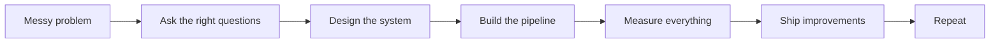

<div align="center">


</div>

---

## `whoami()`

```python
class AnshikaBajpai:
    location = "Indiana, USA"
    education = "M.S. in Data Science @ Indiana University Bloomington"
    current_work = "Research Assistant working on medical imaging + generative AI"
    past = ["Senior Software Engineer @ Optum", "ML Engineer Intern @ Palo Alto Networks"]
    focus = [
        "LLMs and RAG systems",
        "Machine learning for healthcare",
        "Production-grade backend and data systems",
        "Applied AI that people actually use"
    ]

    def build(self):
        return "systems that are fast, measurable, and hard to ignore"
```

<div align="center">

### ⚡ A quick snapshot

| 500+ min → <3 min | 10,000+ users | Dice 0.415 → 0.774 |
|---|---|---|
| Reworked a legacy workflow into something usable | Built internal AI/RAG tooling at scale | Improved prostate MRI segmentation with fine-tuning |

| 10% lift | ~$500K savings | 25,000 → ~20 errors |
|---|---|---|
| Promo-code feature that improved engagement and profits | Paperless compliance notice impact | Cut noisy report volume dramatically |

</div>

---

## neon dashboard

<table>
<tr>
<td width="50%" valign="top">

### 🧠 What I work on
- **LLM systems**: RAG pipelines, prompt orchestration, multi-turn agents, retrieval quality
- **ML research**: medical imaging, segmentation, GANs, diffusion, evaluation
- **Software engineering**: backend APIs, data pipelines, scalable systems, CI/CD
- **Data science**: experimentation, analytics, model comparison, production metrics

</td>
<td width="50%" valign="top">

### What I care about
- Building things that move from **idea → system → measurable impact**
- AI that is useful outside demos
- Strong engineering behind ML
- Clean design, reliable pipelines, better latency, better outputs

</td>
</tr>
</table>

---

## featured builds

### 1) Enterprise RAG portal for internal document Q&A
**Where:** Palo Alto Networks  
**Built:** Full-stack AI portal for internal enterprise search and conversational Q&A

**Highlights**
- Built a system that supported **10,000+ employees**
- Worked across **Streamlit + FastAPI + Uvicorn + GCP**
- Integrated retrieval, ranking, caching, and conversational context handling
- Improved how teams could find answers across internal documentation without digging through scattered sources

**Why it matters**  
This was not just “chat with docs.” It was about making retrieval actually useful in a real enterprise setup.

---

### 2) Prostate MRI segmentation with MONAI + UNet
**Where:** Indiana University research  
**Built:** Medical imaging pipeline for prostate segmentation on MRI scans

**Highlights**
- Worked on **zero-shot vs fine-tuned** model behavior
- Improved **Dice score from ~0.415 to ~0.774**
- Trained and evaluated on **Big Red 200** with GPU workflows
- Focused on practical tuning choices, inference quality, and model behavior analysis

**Why it matters**  
I like ML work where results are visible, measurable, and tied to a meaningful use case.

---

### 3) Promo code system for POS applications
**Where:** Optum  
**Built:** Secure promo code functionality with encryption logic for Point of Sale systems

**Highlights**
- Led a **team of four**
- Worked with stakeholders during U.S. business hours
- Delivered a feature tied to **10% improvement in engagement, retention, and profit**
- Balanced backend logic, product needs, and coordination across teams

**Why it matters**  
It pushed me beyond coding into ownership, execution, and communication.

---

### 4) Hindi tweet sentiment analysis research
**Built:** Research project on multilingual sentiment analysis  
**Highlights**
- Led the project end-to-end
- Research was **accepted, presented, and moved to final publishing stages**
- Reinforced my long-term interest in **multilingual NLP**

---

## system map



---

## tech stack

<div align="center">


</div>

### languages


### ml / ai


### backend / cloud / systems


---

## currently in my orbit

- 🧬 Medical imaging, segmentation, and generative models
- 🔎 Retrieval quality, chunking, ranking, and evaluation in RAG systems
- 🧱 Backend systems that support AI products in the real world
- 🌍 Multilingual NLP and applied AI with strong product value
- 📈 Data-driven systems where impact is visible, not vague

---

## experience at a glance

| Role | Focus |
|---|---|
| **Research Assistant, Indiana University** | Medical imaging, generative AI, segmentation, model evaluation |
| **ML Engineer Intern, Palo Alto Networks** | RAG systems, internal AI tooling, enterprise-scale document intelligence |
| **Senior Software Engineer, Optum** | Backend systems, healthcare platforms, secure product features, system improvements |

---

## beyond the resume

- I like **math, puzzles, and systems thinking**
- I enjoy work that sits at the intersection of **ML + engineering + product usefulness**
- I am especially interested in **AI/ML roles, LLM systems, software engineering, and applied research**

---

## one-line version

> I build AI and software systems that are practical, measurable, and a little hard to forget.

---

<div align="center">

### Thanks for stopping by ⚡

**Always building. Always learning. Always trying to make the next system cleaner, faster, and smarter.**


</div>
